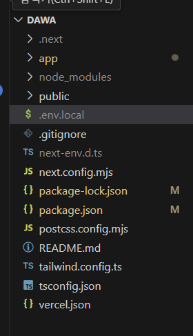

# .env.local에 대해서 

## env.local은?

 Next.js에서 환경 변수를 저장하는 파일이다. 이 파일을 활용하면 API 키, 데이터베이스 연결 정보 등과 같은 민감한 정보를 코드에 직접 작성하지 않고, 별도의 환경 변수로 관리할 수 있다.

+ 민감한 정보이기 떄문에.`gitignore`을 사용하여 깃허브에는 올라가지는 않다.

`Next.js 실행 시 로드`됨

next dev, next start, next build를 실행할 때 자동으로 로드된다.
개발 환경에서 설정한 변수만 반영되므로 환경별(개발/운영)로 설정을 분리할 수 있다.

## 위치가 어디?




가장 최상위 루트에 쓴다.

## 이름이 꼭 env.local이 아니어도 되나?

꼭 아니어도 되지만,
+ env.local → 로컬 개발 환경에서만 적용됨

+ env.production → 프로덕션 환경에서 적용됨

+ env.development → 개발 환경에서 적용됨


## 사용코드
`.env.local`
```javascript
NEXT_PUBLIC_REACT_APP_BASE_URL=https://guiding-fully-gecko.ngrok-free.app
```

대문자 변수이름= 값

`axios 쓸떄`
```javascript
const api = axios.create({
  baseURL: process.env.NEXT_PUBLIC_API_BASE_URL, // 환경 변수 적용
  headers: {
    "Content-Type": "application/json",
    "Authorization": `Bearer ${process.env.NEXT_PUBLIC_API_KEY}` // API 키 추가
  },
```