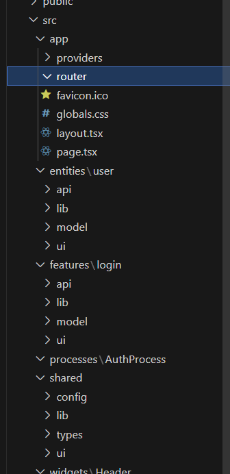

# Refresh Token 

# 개념

    Refresh Token은 Access Token을 재발급할 때 사용하는 키이다. 
    Access Token이 긴 만료 시간을 가지게 되면, 탈취당하여 악의적인 공격에 사용될 수 있다. 
    따라서 Access Token의 만료 기간을 짧게 유지하고, 상대적으로 긴 만료 시간을 가지는 Refresh Token을 통해 Access Token을 재발급 받음으로서 사용자가 로그아웃 없이 로그인 상태를 유지할 수 있게 한다.

로그인을 길게 해주게 해주는거!

