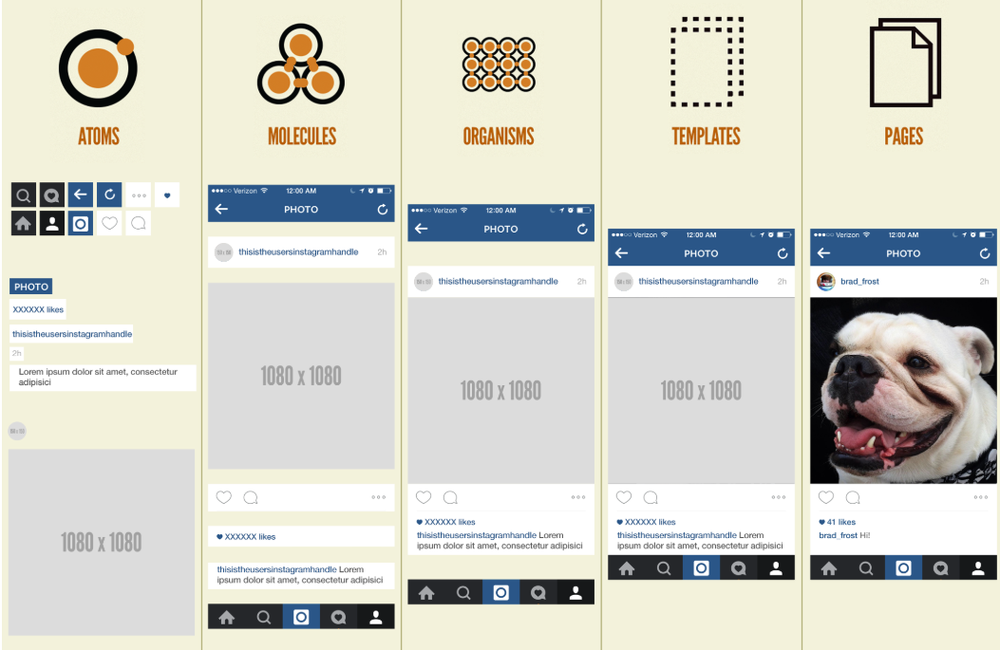

# 스토리북

### 스토리북은 뭐지??

컴포넌트를 정리해주고 컴포넌트 구현코드를 문서화해준다.

## 설치

     npx storybook@latest init

설치하는중에 이게 떴다.

이게 뭘까? 한번 찾아보니 , 질문을 하는것이었다. 

#### 1. Documentation: MDX, auto-generated component docs

Storybook을 문서화 도구로 사용할 것인지 묻는 항목. 컴포넌트에 대한 자동 문서 (MDX 기반 문서 등)를 생성

#### 2. Testing: Fast browser-based component tests, watch mode

Storybook을 컴포넌트 테스트 도구로도 사용할지 묻는 항목. 브라우저에서 빠르게 테스트할 수 있게 함

나 같은 경우는 하나하나씩 page.tsx로 지정하고 싶지 않았기 때문이므로  `Documentation: MDX, auto-generated component docs` 을 선택했다. 

## 설치를 한후의 변화

storybook 폴더에 두가지가 있는데

#### main.ts

`main.ts`에는 스토리북에 대한 전반적인 설명이

#### preview.ts

`preview.ts` 에는 미리보기 화면에 대해서 설정할수 있다. 

previs.ts를 통해 ui 가 어떻게 렌더링 될것인지 보여줄것이다.
+ css import 할수있고 js 도 가능하다.

## 실행

      npm run storybook
      