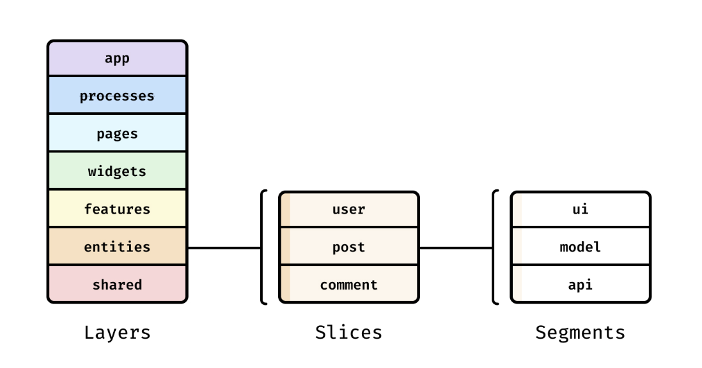

# fsd 아키텍쳐

## 그전에 아키텍쳐는?

소프트웨어 시스템을 구성하는 기본 구조와 그 구조를 구성하는 요소들 간의 관계를 정의한 **설계도**

프론트쪽에서 아키텍쳐는 `파일 구조, 폴더 배치, 컴포넌트/상태/API 분리 방법`을 말하는것이다. 

### 아키텍쳐의 종류 

| 아키텍처 이름                     | 설명                         |
| --------------------------- | -------------------------- |
| FSD (Feature-Sliced Design) | 기능 단위로 파일과 폴더를 나눔          |
| Atomic Design               | UI 컴포넌트를 원자 → 분자 → 유기체로 구성 |
| MVC (Model-View-Controller) | 데이터, 화면, 로직을 분리            |
| MVVM (Model-View-ViewModel) | 뷰모델을 통해 상태를 중재             |
| Pages/Components 기반         | Next.js 초기에 자주 쓰이는 단순한 구조  |

그중에서 오늘은 fsd 아키텍쳐에 대해서 공부해보자

# FSD 아키텍쳐

간단설명: 기능 단위로 묶어서 파일구조를 이룸
| 계층           | 의미                                | 예시                                  |
| ------------ | --------------------------------- | ----------------------------------- |
| `app/`       | 전역 설정, layout.tsx, provider.tsx 등 | 레이아웃, metadata, i18n 설정             |
| `entities/`  | 핵심 도메인 단위, CRUD 중심 로직             | `user`, `post`, `product`           |
| `features/`  | 특정 사용자 액션 단위 기능                   | `login`, `add-to-cart`, `like-post` |
| `widgets/`   | 여러 feature나 entity를 조합한 UI        | `Header`, `Sidebar`, `PostList`     |
| `processes/` | 특정 시나리오 전체 흐름                     | `CheckoutFlow`, `AuthProcess`       |
| `shared/`    | 범용 코드(재사용 UI, lib, types)         | `Button`, `Input`, `useDebounce`    |

솔직히 이거 보고 이해가 가지 않아서 로그인을 예시로 한번 fsd 아키텍쳐를나눠보자

        src/
        ├── app/
        │   └── login/
        │       └── page.tsx         ← 사용자가 /login 경로로 접근
        ├── entities/
        │   └── user/
        │       ├── api/             ← 사용자 정보 가져오기, 저장하기
        │       ├── model/           ← 사용자 상태 관리 (로그인 여부, 사용자 데이터)
        │       └── ui/              ← Avatar, UserName 등 사용자 관련 UI
        ├── features/
        │   └── login/
        │       ├── ui/              ← LoginForm.tsx (이메일, 비번 입력폼)
        │       ├── model/           ← 로그인 상태, 오류 상태, loading 상태
        │       ├── api/             ← login 요청 (`POST /login`)
        │       └── lib/             ← 입력값 검증, 에러 메시지 처리
        ├── widgets/
        │   └── LoginPanel/          ← 로그인폼 + 기타 설명 포함된 조합 UI
        ├── processes/
        │   └── AuthProcess/         ← 로그인 → 사용자 상태 저장 → 리디렉션 전체 흐름
        ├── shared/
        │   ├── ui/                  ← Button, Input 등 공용 UI
        │   ├── hooks/               ← useDebounce, useToggle 등 커스텀 훅
        │   ├── lib/                 ← 공통 함수: API 클라이언트 등
        │   └── types/               ← User, LoginForm 등 공통 타입

#### 자세한 설명 시작

| 계층                       | 로그인 기능에서의 역할                                           |
| ------------------------ | ------------------------------------------------------ |
| `app/`                   | `/login/page.tsx`에서 로그인 UI를 렌더링. 전체 앱 레이아웃, 테마, 라우팅 구성 |
| `entities/user/`         | 로그인 후 사용자 정보를 저장, 조회. 사용자 이름/프로필 UI 관리                 |
| `features/login/`        | 로그인 기능 자체 (입력 폼, 로그인 버튼, API 호출, 상태 관리 등)              |
| `widgets/LoginPanel/`    | 로그인 폼 + 텍스트 + 기타 UI를 조합한 하나의 시각적 블록                    |
| `processes/AuthProcess/` | 로그인 성공 시 → 사용자 정보 저장 → 리디렉션까지 전체 처리                    |
| `shared/`                | 버튼, 인풋, 훅, 유틸 등 어디에서나 재사용 가능한 범용 코드                    |

### (잠깐!)pages를 쓰면 안된다고요?!
(참고로 next js 기준에서말하는것이다 )

그이유는..
next js는 두가지의 라우팅 방법이기 때문이다. 

#### `app routing` : app 폴더가 있어야지 가능 --> next js에서 쓰임 
#### `pages routing`: pages폴더가 있어야지 가능

`Next.js`는 프로젝트 안에 app/과 pages/가 동시에 존재하면, app/만 인식
그러므로 app 폴더에는 pages를 쓰면안된다. 

# 써보기
fsd 아키텍쳐를 고려하여 만든 파일구조.
(사실 이게 맞는지 모르겠다...)
