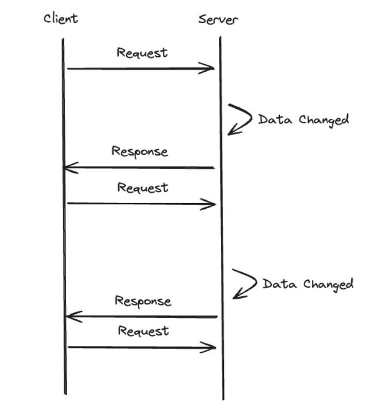

# sse(Server-Sent-Event)

# 원리: 서버에서 클라이언트(브라우저)로 실시간 데이터를 전송하는 기술
서현개념: 실시간으로 보내주는거 

서버와 클라이언트 방향은 한방향이다. 
`sse` 는 클라이언트가 서버와 HTTP connection을 맺어두면, **서버에서 데이터의 변화가 있을때마다** 응답을 보낸다.

## 이전에 

원래 이전에는 short polling 방식을 사용하였는데 
`short polling`: 클라이언트에 주기적으로 api를 요청함 하지만 단점으로 너무나 많은 서버요청수로 인해 문제점있었다. 

그래서 나온 방법이 sse 이다.

# 장단점

+ 장점 : 네트워크 연결이 끊겼을 때 자동으로 재연결을 시도한다
+ 단점:  단방향 통신이며, 한 번 보내면 취소가 불가능하다는 단점이 있다. 
SSE는 지속적인 연결을 유지해야 하므로, 많은 클라이언트가 동시에 연결을 유지할 경우 서버 부담이 커질 수 있다.

# 사용법(프론트입장)

`EventSource` 이거만 하나쓰면된다. 