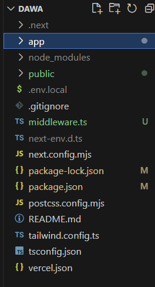

# next js 미들웨어

## 개요
어스 부분에서 회원가입과 로그인 token이 없는 유저가 왔을때 홈페이지가 아닌 로그인으로 이동하기를 원했기 떄문에


## 정의
 
요청(Request)이 서버에 도달하기 전에 실행되어 요청을 수정하거나 리다이렉션, 인증 확인 등의 작업을 수행할 수 있는 기능이다.

**간단히 말해, 라우팅 전에 실행되는 서버 사이드 로직을 작성할 수 있게 해준다.**

## 사용방법
따로 설치 필요없이 그냥 루트 디렉토리에 `middleware.ts`을 생성하면 된다.
이름은 꼭 **middleware.ts** 아니며 **middleware.js** 이어야한다.

파일 위치


## 코드 예시
```typescript
// middleware.ts
import { NextResponse } from 'next/server'  
import type { NextRequest } from 'next/server'

export function middleware(request: NextRequest) { //미들웨어 함수 정의
  const token = request.cookies.get('authToken') //사용자의 쿠키에서 authtoken이라는 이름의 값을 가져옴

  if(!token){
  //토큰이 없으면 로그인 페이지로 리디렉션 
  return NextResponse.redirect(new URL('/login',request.url))
  }

  //토큰이 있으면 요청을 그대로 진행
  return NextResponse.next();


  //어떤 경로에 대해 미들웨어가 적용될지 설정
  export const config={
    matcher;['/main/:path*'], 특정 경로에만 밈들웨어 적용
  }
}
```

## 코드 설명

**NextRequest**: `들어온` 요청을 다루는 객체 (쿠키, 헤더 등확인)
**NextResponse**: `응답을 생성`하고 , 페이지를 리디렉션하거나 상태 코드를 반환

## 장단점

### 장점:
+ 페이지 렌더링 전에 요청을 제어할수 있어, 인증/권한 관리에 최적하다
+ 응답 속도가 빠르다
+ 페이지 이동,url 변경드잉 간편하다
### 단점: 

+ Node js.api 사용불가: 
+ 파일 무거워짐 / 캐시 : 모든 요청에 대해 실행되므로 비효율적인 로직이 들어감 

**단점을 보완해주는 `matcher`**  
캐시랑 파일이 무거워해지는 문제를 수정해주는것이 matcher이다.
왜냐하면

`matche`은 미들웨어를 꼭 사용해야하는 부분들에게다가 사용하기 때문에, 모든 요청에 대해 실행되지 않으므로 성능의 부하를 줄인다..!

### 미들웨어 사용을 지양해야하는 경우

+ db를 조회해야하는 경우 
+ 외부 api 호출이 필요한 경우
+ 페이지 렌더링 후에 클라이언트에서 처리해도 되는경우(alert)
+ 많은 경로에서 다양한 조건 분기/복잡한 로직이 필요한경우


## 안되는데?????


자 다 이해했나..? 아무튼 실제로 써먹어봐야징 냠냠
근데, 안된다고???

왜지??
