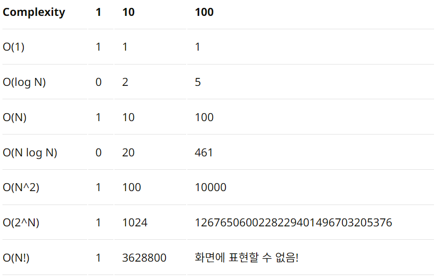

# 시간복잡도 

## 정의

코드가 실행되는 시간이 빠른지, 느린지를 알고리즘으로 나타나는거

즉 알고리즘의 성능을 좋게 하기 위한 알고리즘

### 점금적 표기법
`점금적 표기법`: 중요하지 않은 상수와 계수들을 제거하면 알고리즘에서 실행시간이 중요한 성장률을 말한다.

점금적 표기법은 3가지가 있는데

+ 최상: 오메가 표기법
+ 평균: 세타 표기법
+ 최악: 빅오 표기법

#### 놀랍게도 최악의 경우인 빅오 표기법을 기준으로 알고리즘에서 사용한다.

# 빅오표기법

불필요한 연산을 제거하여 알고리즘 분석을 쉽게 할 목적으로 사용

+ 시간복잡도 : 입력된 n의 크기에따라 실행되는 `조작의 수`
+ 공간복잡도 : 알고리즘이 실행될때 사용하는 `메모리의 양`

***

빅오표기법은 이런것이 있는데, 하나하나씩 설명하겠다

### O(1) 

`입력값의 크기와 관계없이, 즉시 출력값을 얻어낼 수 있다는 의미`다.
입력값이 증가하더라도 시간이 늘어나지 않는다.

ex) 입력값이 1일때 코드의 실행이 1인거

### O(n)

`입력값이 증가함에 따라 시간 또한 같은 비율로 증가`

ex) 입력값이 1 증가할때마다 코드의 실행이 2증가하는거 

#### O(2n)이 아닌것에 주의하자

### O(log n)

 O(1) 다음으로 빠른 시간 복잡도를 가짐

### 