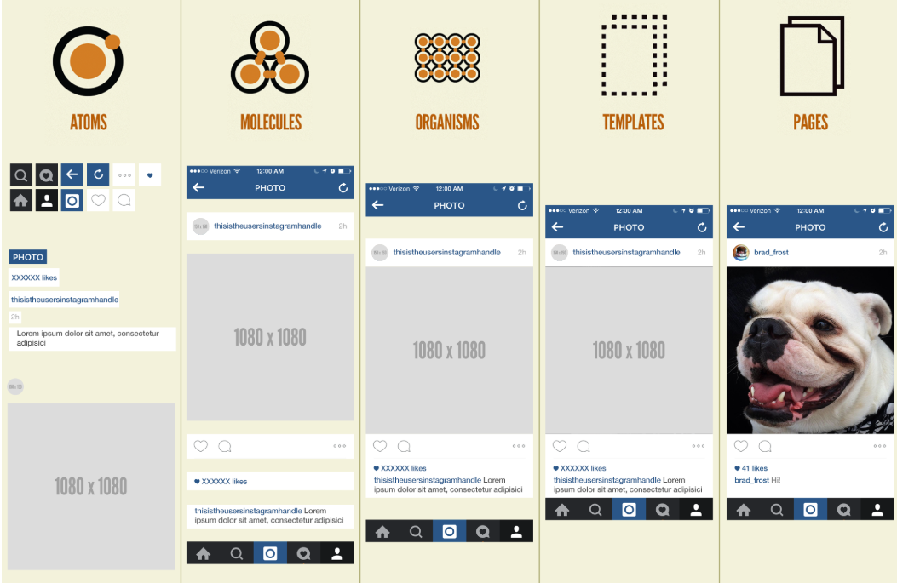

# 아토믹 디자인 패턴

## 개요

프로젝트에서 파일디렉토리를 하다보니 아토믹디자인 패턴으로 바뀌어서 공부하자고자 작성중..!

## 아토믹 디자인 패턴이뭔데??

**정의**
아토믹 디자인 패턴은 UI 설계 방법 중 하나로, 복잡한 화면을 분해 가능한 가장 작은 단위인 원자 단위까지 나누어, 각 요소간 컴포넌트의 재활용성을 높이고 복잡한 화면 구성을 쉽게 제작하는 접근 방식 중 하나입니다.

+ 서현식 설명: 하나하나씩 나눈것 , 하나하나씩 나눠서 조금 합친거랑 조금 합친거끼리 또 합친거

## 구성 
+ Atoms(원자) : 더 이상 쪼갤 수 없는 **최소 단위**.
+ Molecules(분자) : 원자가 모여서 만들어지며, **최소 1가지 기능을 수행한다**.
+ Organisms(유기체) : 원자와 분자들을 모아 만들어지고, **사용자에게 의미와 역할이 존재하는 단위**
+ Templates(템플릿) : 유기체가 모여 만들어지고, **실제 데이터가 포함되기 전의 컨텐츠의 최종 레이아웃**
+ Pages(페이지) : 최종적으로 사용자에게 보여지는 **완성된 페이지**

   Atoms > Molecules > Organisms > Templates > Page

   

   이 그림을보면 처음에는 각자 이미지 하나하나씩 떨어져있지만 점점 단위가 커질수록 붙어있는것을 확인할수 있다.

   ## 완전 개쩌는 아토믹 디자인 패턴 하지만 ...! 

         정리하지면, 아토믹 디자인 패턴은 개발자 뿐만 아니라 디자이너도 함께 이해해야 하는 원칙입니다.  

   아토믹 디자인 패턴은 사람마다 생각이 다를수 있다. 누가 생각하기에는 이게 분자일수독 템플릿일수도 있다.
   이것은 사람마다 생각이 다르기때문에, 아토믹디자인을 팀프로젝트에 사용할려면 디자인과 개발자와 대화가 잘 통해야한다. 

### 이걸통해 아토믹디자인 패턴에서 조심해야하는것

+ 개발자와 디자이너 모두에게 엄청난 대화 충돌
+ (중요) 명확하지 않은 기준들로 인한 의견 충돌이 매우 많다.
+ 프로젝트의 규모가 커질 수록 유지보수와 관리가 급속도로 어려워진다.