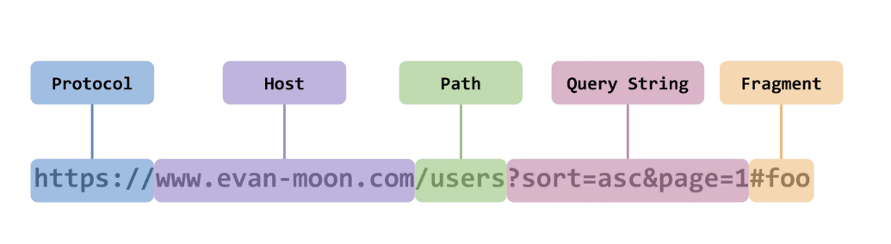
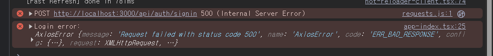

# locall host https 변환하기

# 오류 개요
프로젝트를 배포했다. 하지만 수정해야하는 부분들이 있어서, 코드를 수정해야하는데, 배포를 한 상태에서는 코드 수정을 해도 변경사항이 안 변한다.

그럼 어떻게 해야할까?

백엔드: **localhost(http) --> https로 바꿔** 

근데 왜 ? 바꿔야하지?

    백엔드가 HTTPS이고 프론트엔드가 HTTP라서 서로 다른 origin으로 인식되어 요청이 차단됨

아하 이런 문제로인해서 안되구나.
그러면 우선 오류에 대해서 하나하나 차근하게 알아볼까?

# 오류 

```typescript
Login:1 Access to XMLHttpRequest at 'https://api.gsm-dawa.com/auth/signin' from origin 'https://localhost:3000' has been blocked by CORS policy: Response to preflight request doesn't pass access control check: No 'Access-Control-Allow-Origin' header is present on the requested resource.이 오류 이해하기
requests.js:1 
           POST https://api.gsm-dawa.com/auth/signin net::ERR_FAILED
```

### 오류 해석

      요청 출처(origin): https://localhost:3000

      요청 대상: https://api.gsm-dawa.com/auth/signin

+ 나의 해석: `'https://localhost:3000'`로부터  'https://api.gsm-dawa.com/auth/signin'를 보냈는데 CORS 정책으로 인해 빠꾸먹음

+ GTP 해석: CORS(Cross-Origin Resource Sharing)**에 의해 API 요청을 차단했다는 뜻입니다.

**결론**: 아하 CORS 정책으로 인해서 바꾸먹었구나.! 
그러면 CORS정책이 뭐지???

## CORS 정책

CORS 정책은?

**정의**: CORS (Cross-Origin Resource Sharing)는 웹 `브라우저가 출처(origin)가 다른 서버에 요청을 보낼 때, 보안을 위해 이를 제한하거나 허용하는 정책입니다. ` 을 말하는것이다. 

출처가 뭐지..?

### (더보기)출처에 대해서



출처(Origin): `프로토콜 + 도메인 + 포트`가 모두 같아야 같은 출처로 간주합니다.
+  프로토콜: http, https
+ 도메인 :  example.com
+ 포트 : 3000, 8080

아하 프론트와 백 출처가 같아야지 CORS 오류가 안나는거구나..!
그럼 지금 상황에서 CORS 오류가 나는 이유는 출처가 다르기 때문이구나!
***

즉 CORS 정책은 프론트와 백엔드의 출처가 같은 출처인지 확인하느거

즉 쉽게 말해서 **깐깐스러운 보안정책?**


cors 작동 방법


    1. 브라우저는 HTTP 요청을 보낸다.
    2. 서버는 요청에 대한 응답을 반환한다.
    3. 브라우저는 응답을 분석하여 CORS 헤더를 확인한다.
    4. CORS 헤더가 존재하면 브라우저는 자원에 대한 권한을 검사한다.
    5. 권한이 허용되면 자원을 사용하고, 그렇지 않으면 에러가 발생한다.


# 문제점을 해결방법


## localhost를 http --> https로 변환하기


# 시도했던 방법들

# 1. 프록시(proxy) 방법

**프록시(proxy)란?**
프록시는 

클라이언트(브라우저)가 직접 백엔드 서버에 요청하지 않고, **내가 제어할 수 있는 서버(또는 개발 서버)**에 요청을 보내고, 그 서버가 대신 백엔드에 요청해서 데이터를 받아와 클라이언트에 다시 전달합니다.

## 왜 지금같은 상황에서 프록시를 사용해야 하나?
브라우저 입장에서 보면, 프론트엔드 개발 서버(localhost:3000)와 프록시 서버(localhost:3000 혹은 동일 도메인) 사이 요청은 **동일 출처(same-origin)**로 간주되어 CORS 오류가 발생하지 않습니다.

프록시 서버가 백엔드와 통신할 때는 서버 간 통신이기 때문에 CORS 제약이 없고, 프로토콜/도메인이 달라도 자유롭게 요청 가능합니다.


## 프록시 사용법 

`next.confing.js`
```js
/** @type {import('next').NextConfig} */
const nextConfig = {
  async rewrites() {
    return [
      {
        source: '/api/auth/:path*',
        destination: 'https://api.gsm-dawa.com/api/auth/:path*', // 프록시 대상
      },
    ]
  },
}

module.exports = nextConfig

```
`login.tsx`

```ts

        try {
            const response = await axios.post(
                `/api/auth/signin`,
                {
                    email: fullEmail,
                    password: PasswordValue,
                },
                {
                    headers: {
                        'Content-Type': 'application/json',
                    },
                    withCredentials: true,
                }
            );
        }
```


결과 : 


응 500~