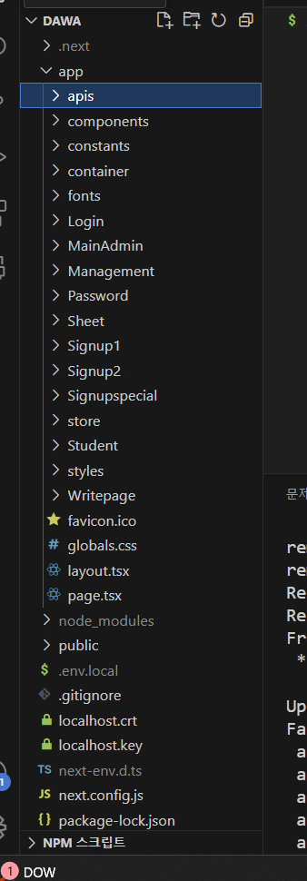

# 다와 파일 디렉토링 정리

오늘은 다와 파일구조가 바뀜겸 정리를 해보고자 한다.



큰틀

### app

+ apis
+ components
+ constants
+ container
+ fonts
+ Login
+ MainAdmin
+ Management
+ Password
+ Sheet
+ Signup1
+ Singnup2
+ Signupspecial
+ store
+ Student
+ styles
+ Write page

각 설명을 해보자

## apis
api들 모아놓은거 
## components
    --@Mlecules
    --Organims

여기서는 **아토믹 디자인  패턴**이 사용하였다. 

아토믹디자인에 대해서 짧게 설명하자면? 

### 아토믹 디자인 패턴은? 

        + Atoms(원자) : 더 이상 쪼갤 수 없는 최소 단위.
        + Molecules(분자) : 원자가 모여서 만들어지며, 최소 1가지 기능을 수행한다.
        + Organisms(유기체) : 원자와 분자들을 모아 만들어지고, 사용자에게 의미와 역할이 존재하는 단위
        + Templates(템플릿) : 유기체가 모여 만들어지고, 실제 데이터가 포함되기 전의 컨텐츠의 최종 레이아웃
        + Pages(페이지) : 최종적으로 사용자에게 보여지는 완성된 페이지

지금 여기서 사용한것은 **Molecules**와 **Organisms**이다.

아토믹디자인에서 개념정리로 정리한것이있으니깐 궁금하면 확인할것 

## constants 
이거는 상수인데, 변하지 않는것을 의미한다. 
하지만 이 constants폴더에는 파일구조를 좀 더 쉽게 표현하기 위한것이다.

--> 이게 무슨 말이냐면 

즉 내가 page를 불러올려면 `app/pages/main.tsx`이처럼 경로가 길다. (이미지도 마찬가지)

```ts
export const ICON = {
    SVG_ICON: "/icon/svg",
    PNG_ICON: "/icon/png"
}
```

하지만 이렇게 경로를 더 쉽고 짧게 지정해주면 

```ts

```

이렇게 이미지를 불러올때 쉽게 불러올수 있다. 

즉 `app/public/icon/svg`이것이 `ICON.SVG_ICON` 이렇게 상수로 불러오면 짧게 표현할수 있다.

## container

+ Auth
+  Home
+ Teacher
+ templates

각각 주제에 맞게 나눴다.

## 나머지들 
나머지들은 page.tsx를 위한 폴더이므로 생략~

## store

store이 뭔가하고 찾아봤는데 zustand 관련된것이었다.

store은 zustand에서 `상태(state)를 정의하고 관리하는 파일`들을 모아두는 디렉터리이라는데 

즉 **import { create } from "zustand";** 이렇게 zustand상태를 정의할때 사용되는 코드이다. 


```ts
import { create } from "zustand";
```

store에는  Zustand가 제공하는 create 함수를 사용해 생성됩니다.

zustand에 대해서 더 궁금하면?  --> 정리된거 보러가기


## public

이거 말고도 public폴더에는 `png` 폴더랑 `svg`폴더랑 나뉘었다.


# 결론

이렇게. 혁신적인 파일디렉토리에 대해서 정리해봤다. 좋은 것 같아서 개발할떄도 한번 써봐야지..!