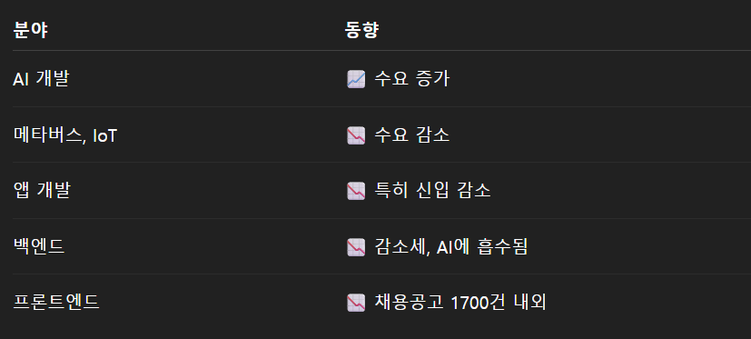

# 라운드 j 커피쳇 정리

일시: 2025.5.21
장소: 
발표자: 임근석(ai 개발자), 김갑열, 류지헌, 최은우(프론트)


# 1. 요즘 개발자 취업 시장, 어디에 집중해야 할까?
## AI 와 밸의 융햡이 핵심

+ 임근석 멘토가 생각하는 AI 변화에 따른 변화

AI에 대한 깊은 이해는 선택이 아닌 피수.
프론트엔드,백엔드,클라우드 분야에 AI를 점목시키는 능력이 중요
GPT 같은 도구를 만드는것보다, 어떻게 활용하는지가 더 중요하다.

    --> 지금이라도 늦지 않았다. 각자의 기존 기술에 AI를 붙여보자

# 2. AI 발전에 따른 신입 개발자의 전략은?

## 기본기 + 실전기 + AI 활용
대기업은 경력직을 선호하지만, 신입도 기회는 있다.
GhatGPT 활용은 못하는것이 아니라 안한느것 뿐.
기본기를 바탕으로 도구 활용 능력을 키워야함. 

--> GPT 한테 물어보는것부터 시작해보자.

# 3. 산업별 채용 트렌드 변화


--> AI 에 밀리지 않으려면, 기존 기술 + AI를 융합해야 생존 가능

# 4. 신입 개발자 전략 : 포토폴리오 전략, "나를 드러내되, 공격 포인트는 주지 말자"

### 강조해야 할것
실패 경험도 기록: 왜 멈췄는지, 어떤 교훈을 얻었는지
기술 스택은 내가 "직접" 써본것만..!

### 피해야할것
모르는 기술 억지로 나열
GPT 에게 받은 코드 그대로 복붙한 티

    --> 기술보다 '이해도'가 중요. 복붙한 코드의 원리도 설명할수 있다. 

# 5. 질문 리스트에 대한 답변

### 토이 프로젝트는 얼마나 만들어야 할까?

기준은 없다. 운영 가능한 서비스를 만들어보자. (혼자만 개발해도 ㅇㅋ)
GPT에게 물어보며 기술 확장도 해볼것

  ex) 예를 들어 기업들이 typescript 을 원하는데, 
      그러면 gpt 한테 내가 하는 프로젝트가 typescript를 쓰고 싶어 라고 물어보기

핵심은 **써봤다** --> **서류 통과** --> **그때부터 진짜 공부**

## 6. 협업 경험 없이 어필하는 법
git 을 활용한 협업 경험도 인정됨
**git 전략 사용** , pr 기반 개발 등도 협업 사례로 어필 가능
혼자 했다고 무시받지 않는다. **배포 경험과 흐름 설명이 중요**


## 좋은 프론트엔드 개발자가 되기 위한 태도
남의 코드를 분석하는 습관
규칙을 이해하고 코드를 응용할수 있는 능력
컬쳐핏(조직 문화 적합성) 도 중요: 서로 배우는 자세

## 8. 고졸 개발자도 기회가 있을까?

있다. 실력만 있으면 고졸도 유리할수 있다.
특히 SI. 서비스 기업등은 졸업장보다 실력 + 운영 경험을 더 중시함.
다만 대기업 중 SI 중심 기업은 학벌을 중시하는 경향이 있음


## 9. 커리어 초반 집중해야할것

+ 다른 사람과 친해지기
+ 클려도 말할수 있는 용기
+ 관심 기술을 정해 꾸준히 실행

## 10. 도식화 및 기획 역량
기획 역량을 키우기 코드 설계 도식화를 연습하자.
추천 툴: `Mermaid Live Editor`


# 결론: AI 시대, 개발자의 생존 전략은 융햡과 이해력

자신의 전공을 하되, 자신의 전공에 AI를 접목시켜라.
단순 사용자가 아닌 , 이해하고 응용할수있는 개발자가 되라.
실패와 시행착오도 경험의 일부다. 숨기지 말고 솔직하게 담아라.


# 정리안한거


마음에 드는 다양한 개발자들끼리 공부를 하는 공간입니다. 

현재 채용 트렌드 분석

최근에 ai

# 주제 1: 임근석님에 요즘 채용 이야기

## 임근석 님 에 대한 설명

### Q. 왜 ai를 전공하는가?

전공은 ai쪽으로 llm을 쪽으로 계속 연구중이다.

할수 있는것은 gpt 같은것을 만들수 있다.

원래는 프,백,클라우드 쪽을 하고 있다가 ai를 한 이유는 ai를 파인듀닝을 하지 못해도 ai를 알고 있으면 

지금 내가 하고 있는 분야를 같이 하돼 ai를 어떻게 점목할수 있을까

아니면 ai를 점목시킬수있을까 라는 생각으로 인해 ai개발을 하게 되었다.

하고 싶은 말: 지금은 안늦었다. ai를 붙여서 지금 각자 만든 프로젝트를 붙여서 해라.

# 취업 시장

카카오에서 세미나를 하고 왔는데 정말로 ai도구를 쓰면서 자기가 역량강화를 할려고한다. 

대기업쪽으로 취업을 할려면 경력직을 요구하고 있다.

그렇다면 신입들은 어떻게 해야할까?

# 신입 전략

어떻게 하면 개발자의 강화할수있을까?

어떻게 하면 ai도구를 사용하면서 내가 하고있는 속도를 끌어올수 있을까를 주제로 더욱더 공부해야한다.

지금까지 했던 공부도 중요하지만, 기본기를 더 중요시 생각해라. 

### 그래서 어떻게 해야하는데?

지금 chat gpt한테 물어보는것을 못하는것이 아니라 귀찮아서 하는거야. 라는 형식으로 하자.

한번도 시간을 들여서 할수있는지를 확인해라

# 산업별 채용 동화 변화

ai 개발자에 대한 수요가 높아지고 있다.

감소하고 있는 부분: 메타버스, iot 마이너스부분이 되고 있는 부분(다른 부분의 시장이 커지고 있기 때문에) 

앱개발자 감소(신입쪽으로 감소) 백엔드가 감소하고 있기 떄문에, ai와 겹치는 부분이 있기 때문에

# (중요) 프론트엔드 개발자 채용공고 현황

1700건. 적다. 많지 않다. 

# 결론: 본인들이 하고 있는 거에다가 ai를 점목시켜라

it 대기업 채용 규목 추곳: 

# 개발자 역량 요구사항의 변화

프로젝트 관리 기능: 본인이 자기 영략에 있는 부분들을 잘 지킨다음에, 협업 능력을 키우자.

기본적인 능력을 가지고 다른 협업 을 통해서 어떻게 협업을 할수 있을지

지금 회사에서는 협업 능력보다 잘하고 있는지를  본다.

### 기본기를 쌓아야할지 알겠어 그러면 어떻게 어필해야하는데? 포토폴리어를 잘 쓰는 방법은?

A. 많이 만들어 본다. 

가장 중요한것이 **실패를 했더라도 왜 실패했는지 왜 중단되었는지를 꼭 작성해라.** 멈춘 개인적인 이유를 적아라.

포토폴리오 구축: 

## 도식화 하는 방법

도식화하는 방법을 알면 기획을 할수 있따.

코드를 설계로 옮기는 방식을 해봐라

`Mermaid Live Editor` 형식으로 만들워줘.

홈페이지: online flowchart & diagrams 

# 결론: ai 공부를 해봐라 (재밌다…?)

# 주제 2 : 멘토 별 전공 및 이름

**김갑열**: c#, 기획,데브옵스

**류지헌**  : 백엔드, 

**최은우** : 프론트엔드

```
2. 프론트엔드 전공자라고 해도 백엔드나 DevOps 같은 분야도 일부 다뤄야 할까요?
3. 프론트엔드 직무에서 요즘 기업들이 중요하게 보는 역량은 무엇인가요?
4. 고졸 출신 개발자의 수요나 가능성은 어떤가요? 실제로 많이 채용하나요?
5. 실제 채용 과정에서 포트폴리오 프로젝트에서 가장 많이 보는 요소는 무엇인가요?
6. 토이 프로젝트라도 어느 정도 수준까지 만들어야 어필이 될까요?
7. 포트폴리오를 쓸 때 강조해야 할 점이나 피해야 할 실수가 있다면 알려주실 수 있나요?
8. 협업 경험이 없더라도 잘 보여줄 수 있는 방법이 있을까요?
9. 현업에서 보기에, 좋은 프론트엔드 개발자가 되기 위해 꼭 갖춰야 할 태도나 습관이 있다면 무엇인가요?
10. 커리어 초반에 어떤 점을 가장 중점적으로 개발하는 게 좋을까요?
11. 개발하면서 슬럼프가 왔을 때 어떻게 극복하셨나요?
12. 최근 AI가 발전하면서 코드까지 자동으로 생성해주는 시대가 되었는데, 이런 상황에서 프론트엔드 개발자는 어떤 역할과 가치를 갖게 될까요?
13.  실제 업무에서 가장 많이 사용하는 기술 스택이나 툴은 무엇인가요?
14. 이력서나 자기소개서에서 눈에 띄는 요소는 무엇이었나요?
15. 커리어를 쌓아가며 ‘이건 정말 미리 준비했으면 좋았겠다’ 싶은 게 있다면 무엇인가요?
16. 조직에서 ‘잘 어울리는 개발자’는 어떤 사람이라고 느끼셨나요?```
```

# 주제 2: 질문 답변

## 1. 프론트 엔드 개발자 시장 :

썩 좋은 상황은 아니다. ai의 발전과 시장이 얼었다. 

## 2. 다른 전공도 해야하는지:

다른 신입한때 하는지, 할줄 안다로 나 뭐도 할수있다. 관심이 있다. 이런식을 의욕정도를 역량을 줄수있는지.

## 3. 요즘 기업들이 가장 중요하게  보는 역량은 무엇인가요?

더욱더 심하지고 있다. gpt가 너무 코드를 잘 짜주고 있기 때문에, 

근데 결국은 복붙한 코드를 얼마나 이해하는가가 중요하다.  ai로 얻어오는 코드 조차 규칙에 의해서 짜졌는데 그 규칙을 이해하지 못하고 마냥 복붙하고 있는 사람이 많은데, 

**어떠한 코드가 있다면 파악하고 이해하는것이 중요하다. 그래야지 응용도 가능하기 떄문이다**

## 4. 고졸 출신 개발자 수요

옛날보다는 유리하다. 요즘은 실력을 본다. 요즘 기업들은 신입을 키울려고 하지 않는다. 이직이 활발히 지기 때문에, 회사들이 신입들을 키우지 않고, 바로바로 쓸수있는 실력이 다르기 때문이다. 대학나온사람과 딱히 중요하지 않기 때문에. 물론 고졸과 대졸의 차이가 있긴한데, 

대기업,서비스,si : 대학교 나온사람이 수요가 많은것은 ai —> 대기업(좀 더 똑똑한 사람들을 원함) —> 서비스 (연봉도 많이 주는데, 졸업장이 중요하지 않음)

어지간한 큰 서비스 기업들은 고졸 출신이라도 상관없이 고졸 출신이 더욱더 유리할수 있다.

### 5.  채용과정에서 포토폴리오에서 가장 많이 보는것은?

면접에서 중요한것은 **이사람을 떨어트릴수있는 이유를 찾는거** 

—>이런거 할줄알아. 그럼 그거 물어봐야지. 질문 공격할수있는 포인트를 만들어준다.

근데 만약 떨어트린 공격을 찾지 못했으면

**포토 폴리오에서 가장 많이 보는것은 면접은 떨어트린 질문을 던지는것이다.**

아까 말한대로 뭐뭐할수잉

hook, 라우팅, api 개발, 좀 더 기초적으로 되는거 

다들 비슷한 기술을 한다. —> **내가 얼마나 알고 썼는지**

## 6. 토이 프로젝트 어느정도 만들어야할까요?

그 기준이없다. next 써봤다. 수준이라고 말하고 싶은것은 : **운영하고 있는 서비스(나만 써도됨)**

관련 기술들이 (스토리북, 토커) 

gpt 한테 물어봐: 내 프로젝트에서 어떤 사용하고 싶어도돼. 다 이해가 안되도 돼. 그냥 나 한번 써봤다. 라고만 쓰자. —> 붙어—> 그러면 이제서야 공부해야함

**`전략`: 간단하게 기능 써볼까. 하고 난 다음에 서류가 붙으면 그때야 공부를 하자**

### 7. 포토폴리오에서 강조해야하는것 , 피해야할것들

```jsx
내가 모르는것을 쓰지 마라
```

면접할때 떨어트리기 위해서 찾아본다.

피해야하느거: 내가 모르는것을 쓰지 않았나. 아니면 ㅁ

왜 썼는지: 단점과 장점을 물어볼수있고,  **집요하구나, 공격거리를 만들거리를 하는것**

큰틀(next ,react) 에서 얼마나 이해하고썼는가를 준비한 포토폴리오에서 이해를 하자 정도

적어도 내가 한것중에서 물어본다. 대화가 이루어진다.  next js에 대해서 썼다. 하고 모든것을 물어보지 않는다. 그냥 내가 한거 내에서 해봤을것 같은것을 물어본다.(안해본것을 물어봐도 감점 포인트는 아니다)

번들리 최적화를 써본사람 

## 7. 협업 경험이 없다로도 잘 보일수있나요?

협업경험이

git을 이용해서 협업경험을 했는지

진짜 협업경험에 대해서 물어보기 떄문에 , 협업하여 코드를 작성하는 경우(git) git 전략을 하는지

```jsx
git 전략
```

그렇게 중요하지 않다. 

베포를 하는 쪽이 좋을까. next에서 무료로 하는것인지. 이것저것 경험하는것인지, 혼자해서 무시하지 말라

# 8. 좋은 프론트엔드의 자세는?

코드에 대해서 더욱더 분석해보고, 제대로 뜯어보는 습관들

회사의 선호도

컬쳐핏 면접 : 내 성향과 그 회사의 성향을 보여주는거  

회사에서 그런 분위기도 그런 분위기 ( 형동생, 같이 공부하자)

**그 성향이 좀 맞는지 확인** 

## 9.  커리어 초반에 어떻게 를 쌓는것인가

중점적으로 개발할려고하는지 — > 여러가지 스킬 다른사람과 친해지는것을 중점이지 않을까

내가 틀려도 잘 얘기를 하는것 같은지 —> 친하게 지내놓으면 사회 생활이 편하다

좋은 회사관계를 통해 좀 더 발전하라

## 10, 개발 자 슬럼프가 왔을때 어떻게 해야하는지

내가 어떨때 행복한가? 의 질문을 통해서 

나와 행복함과 개발을 섞는것 

**슬럼프 왔을 떄 내가 무엇으로 인해 행복하지를 물어봐라**

## 12 . ai가 발달하면서 프론트엔드의 개발자의 가치는?

코드를 시키는사람이 되어라.

내가 능동적으로 지시하는 사람이 되어라. 뭔가의 프로젝트의 흐름을 봐도 설계를 할수있게.

프론트엔드가 하는것은: 

시간이 걸리는 사람의 확률 :  통계를 낼수 있는 스킬들을 넣어라.그 다음 분석을 해라. 통계를 내는거  프론트의 역할 . 내가 이 서비스를 운영하면서 이러한 로직을 사용하면서 소비자의 ux를 고려하여 수정한다. ai가 능동적으로 다 해주지 않았기 떄문에. 로직을 수정한 다음에 매출을 수정.

**ai가 코드를 짜둔다 해도 프론트엔드가 사라지지는 않는다**

이게 왜 틀린코드인지 확인하라. 어떤 코드가 좋은 코드인지 —> 많은 코드를 짜봐라. 그러면 그 코드에 대해서 잘못된을 알수있다. 프로젝트 마다 아키텍키는 상관없다. 내 프로젝트의 규모에 맞게. 

# 코드 잘때 자세

이 코드는 쓰레기야.